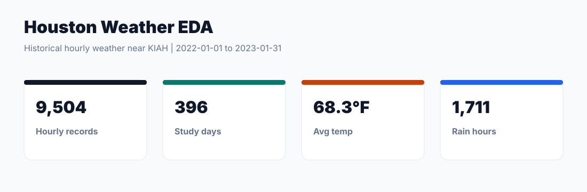
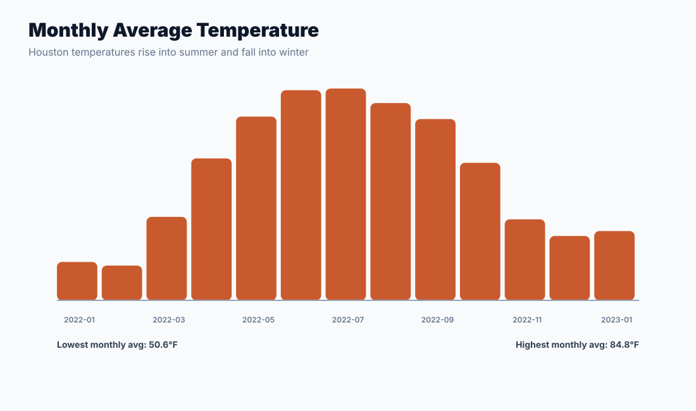
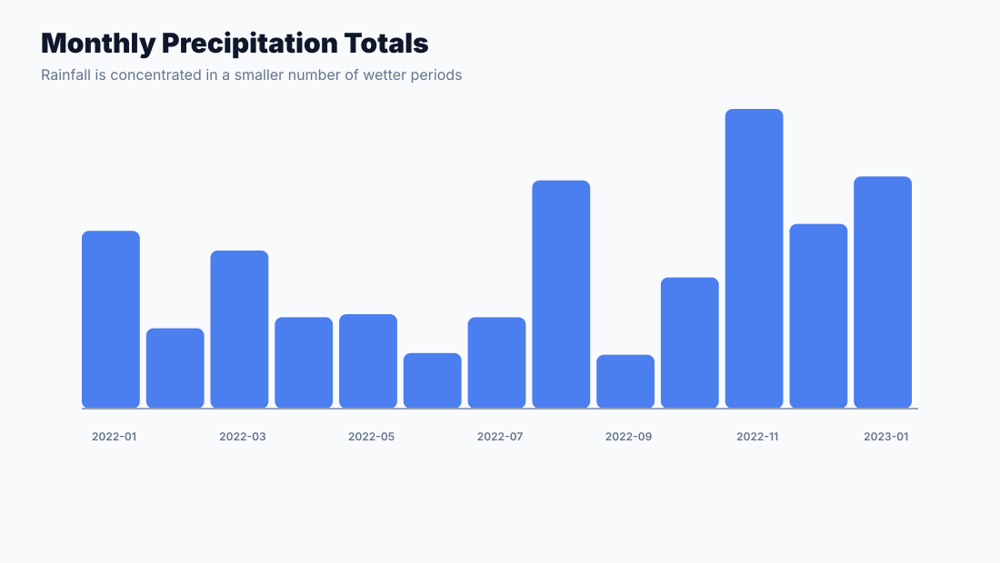
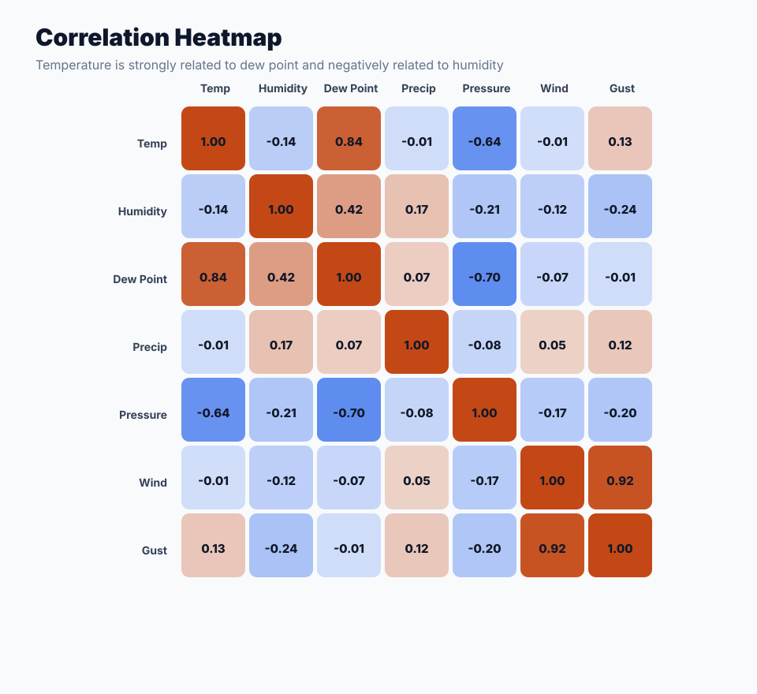
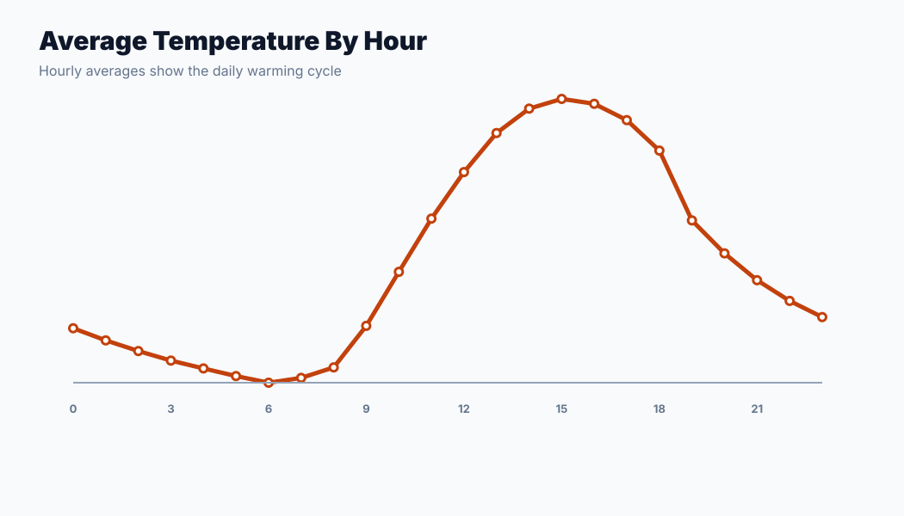

# Houston Weather EDA



## Overview

This project analyzes hourly Houston-area weather patterns from January 2022 through January 2023, focusing on temperature, humidity, dew point, precipitation, pressure, wind speed, and wind gusts.

This portfolio version uses Open-Meteo historical hourly weather data so the workflow can be reproduced through a lightweight API-based fetch script.

## Research Questions

- How do Houston temperatures change across months and hours of the day?
- How are temperature, humidity, dew point, pressure, wind, and precipitation related?
- Which periods show the strongest rainfall or heat patterns?
- What weather insights can be communicated through clean EDA visuals?

## Dataset

Portfolio rebuild source: [Open-Meteo Historical Weather API](https://open-meteo.com/)

Study window:

- `2022-01-01` to `2023-01-31`

Dataset size:

- **9,504** hourly records
- **396** unique days
- **13** columns after date/hour features

Location:

- Houston/KIAH-area coordinates: latitude `29.9844`, longitude `-95.3414`

## Methodology

1. Fetched historical hourly weather data using the Open-Meteo archive API.
2. Loaded hourly temperature, humidity, dew point, precipitation, pressure, wind speed, wind gust, and weather code fields.
3. Created date, hour, and month features.
4. Checked missing values and computed daily/monthly summaries.
5. Built correlation analysis across numeric weather variables.
6. Generated visual summaries for KPIs, monthly temperature, monthly precipitation, correlations, and hourly temperature patterns.

## Key Results

- Hourly records analyzed: **9,504**
- Study days: **396**
- Mean temperature: **68.3°F**
- Maximum temperature: **102.7°F**
- Minimum temperature: **16.0°F**
- Total precipitation: **68.8 inches**
- Rain hours: **1,711**
- Temperature-dew point correlation: **0.839**
- Temperature-humidity correlation: **-0.137**
- Hottest month: **July 2022**, average **84.8°F**
- Rainiest day: **January 24, 2023**, with **2.85 inches**
- Warmest average hour: **3 PM**, average **77.3°F**

## Visual Highlights

### Monthly Temperature



### Monthly Precipitation



### Correlation Heatmap



### Hourly Temperature Cycle



## Interpretation

Houston weather showed a clear seasonal temperature pattern, rising into summer and peaking in July 2022. Temperature and dew point were strongly positively correlated, which matches the idea that warmer air often holds more moisture. Temperature and humidity had a weak negative correlation, suggesting that relative humidity can decrease during hotter hours even when moisture remains present.

Precipitation was concentrated in fewer rainy periods rather than evenly distributed across all hours. The rainiest day in the rebuilt dataset was January 24, 2023.

## Limitations

- Weather variables may differ slightly across sources because of station coverage, reanalysis methods, and measurement definitions.
- This project is EDA-focused and does not forecast weather.

## How To Reproduce

Install dependencies:

```bash
pip install -r requirements.txt
```

Fetch the historical hourly weather data:

```bash
python src/fetch_weather.py
```

Run the analysis and regenerate outputs:

```bash
python src/analyze_weather.py
```

## Project Files

- Data fetch script: [src/fetch_weather.py](src/fetch_weather.py)
- Analysis script: [src/analyze_weather.py](src/analyze_weather.py)
- EDA notebook: [notebooks/01_weather_eda.ipynb](notebooks/01_weather_eda.ipynb)
- Processed summaries: [data/processed/](data/processed/)
- Visuals: [figures/](figures/)

## Skills Demonstrated

- Data cleaning and feature engineering
- Exploratory data analysis
- Time-series aggregation
- Correlation analysis
- Weather pattern interpretation
- Visual storytelling
- Reproducible project packaging

## Contribution Note

This repository is a cleaned portfolio rebuild with emphasis on EDA, feature organization, summary tables, visual storytelling, and reproducible documentation.
